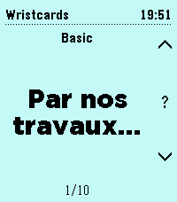
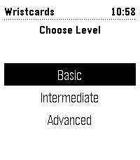
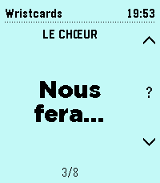
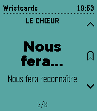
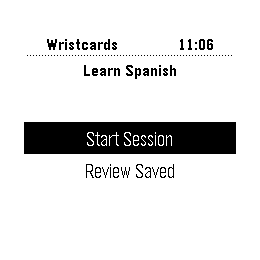
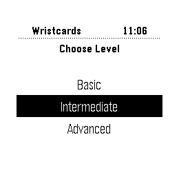
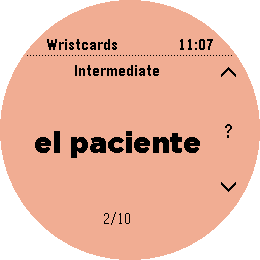
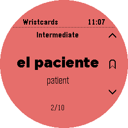

# Wristcards

One Pebble watchapp for vocabulary drills, with the deck chosen on the phone.
Dutch, French, German, Italian and Spanish are ready-made; any text file of
cards will do.

## Screenshots
### Pebble Time 2

### Pebble Time Round 2

## Store
[Pebble App Store](https://apps.repebble.com/6aae5837cf733a0009498c16)

[Rebble App Store](https://apps.rebble.io/en_US/application/6aae5837cf733a0009498c16)

## Features
### Customizable Deck
- Pick one of premade deck or make your own
- Download a deck and self-host it, or load a single file for quick test

## License

MIT License - feel free to modify and share!

